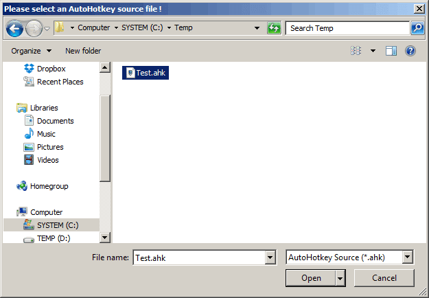
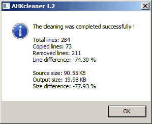
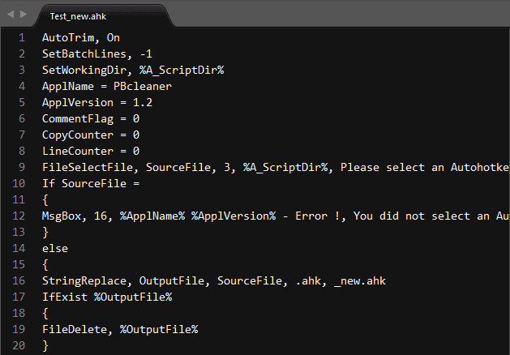

# AHKcleaner - README #
---

### Overview ###

The **AHKcleaner** removes comments, empty lines and unnecessary whitespaces from AutoHotkey source files.

### Screenshots ###

### Setup ###

* Start the **AHKcleaner.exe** executable with a doubleclick.
* Select a AutoHotkey source code file.
* Press the button **Open** to start the cleaning process.
* A result information window will be displayed.
* A new file with the cleaned code will be created.

### Support ###

This is a free tool and support is not included and guaranteed. Nevertheless I will try to answer all your questions if possible. So write to my email address **biegel[at]gmx.ch** if you have a question :-)
